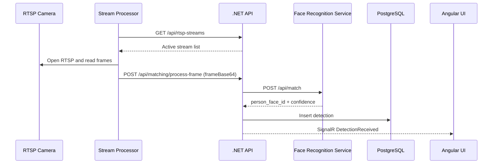

# Project Run Guide and Data Flow

This document explains how to run the Person Identification System and how data moves through the services.

## 1. What this project contains

- .NET API: `src/PersonIdentificationSystem.API`
- Angular UI: `src/PersonIdentificationSystem.UI`
- Python merged service (face recognition API + stream processor runtime): `src/PersonIdentificationSystem.Python/face_recognition_service`
- Python stream processor modules (embedded by merged runtime): `src/PersonIdentificationSystem.Python/stream_processor`
- Database init scripts: `src/Database/init-scripts`

## 2. Prerequisites

- Docker Desktop with Docker Compose
- Optional for local (non-Docker) run:
  - .NET SDK 8+
  - Node.js 18+
  - Python 3.10+

## 3. Run with Docker Compose (recommended)

From repository root:

```powershell
cd C:\Users\Lenovo\source\repos\person-identification-system
docker compose up -d --build
```

Check status:

```powershell
docker compose ps
```

View logs for key services:

```powershell
docker compose logs -f api
docker compose logs -f face-recognition
```

### Main endpoints after startup

- UI: http://localhost:4200
- API Swagger: http://localhost:5000
- API Health: http://localhost:5000/health
- Face Recognition Health (if exposed): http://localhost:8000/health
- MJPEG Streams: http://localhost:8085/stream/{streamId}/mjpeg

Notes:

- In Docker, API is mapped from container port 8080 to host 5000.
- The face-recognition container also runs the stream manager runtime in-process during FastAPI startup.
- PostgreSQL and Redis are started by compose and wired internally.

## 4. Local development run (without Docker for app services)

If you want to run services manually in separate terminals:

### Terminal 1: API

```powershell
cd src\PersonIdentificationSystem.API
dotnet restore
dotnet run
```

Expected default local URL is typically https://localhost:5001.

### Terminal 2: UI

```powershell
cd src\PersonIdentificationSystem.UI
npm install
npm start
```

UI runs on http://localhost:4200.

### Terminal 3: Merged Python service

```powershell
cd src\PersonIdentificationSystem.Python
pip install -r face_recognition_service\requirements.txt
pip install -r stream_processor\requirements.txt
uvicorn face_recognition_service.main:app --reload --port 8000
```

## 5. Quick verification checklist

1. API responds: open `/health`.
2. UI opens at http://localhost:4200.
3. At least one RTSP stream is configured and active in the database/API.
4. Face-recognition logs show merged stream task startup and MJPEG startup.
5. Detection records appear via API `/api/detections`.
6. Live events are emitted through SignalR hub `/hubs/detections`.

Merged health output now includes:

- `compreface_reachable`
- `stream_runtime_enabled`
- `stream_manager_running`
- `mjpeg_server_running`
- `active_stream_buffers`

## 6. Data flow

### Runtime flow (high level)

1. Merged Python runtime pulls active streams from API endpoint `/api/rtsp-streams`.
2. For each active stream, RTSP frames are sampled.
3. Faces are detected in embedded stream processor module.
4. Cropped face frame is sent to API endpoint `/api/matching/process-frame`.
5. API MatchingService calls Python face recognition endpoint `/api/match`.
6. Face recognition returns match decision and confidence.
7. API maps the returned `person_face_id` to a Person record.
8. API stores detection in PostgreSQL.
9. API sends notification using NotificationService (email path).
10. API broadcasts detection event via SignalR hub `/hubs/detections`.
11. Angular UI receives and displays live detection updates.

### Sequence diagram



## 7. Troubleshooting tips

- If API build fails with locked files on Windows, stop previous running API process first.
- If stream appears online but no video/detections, validate RTSP URL/path/auth (camera may reject DESCRIBE).
- If no detections appear, confirm face-recognition service is running and that merged stream runtime is enabled.
- If UI loads but no live events, verify SignalR URL and CORS settings.
